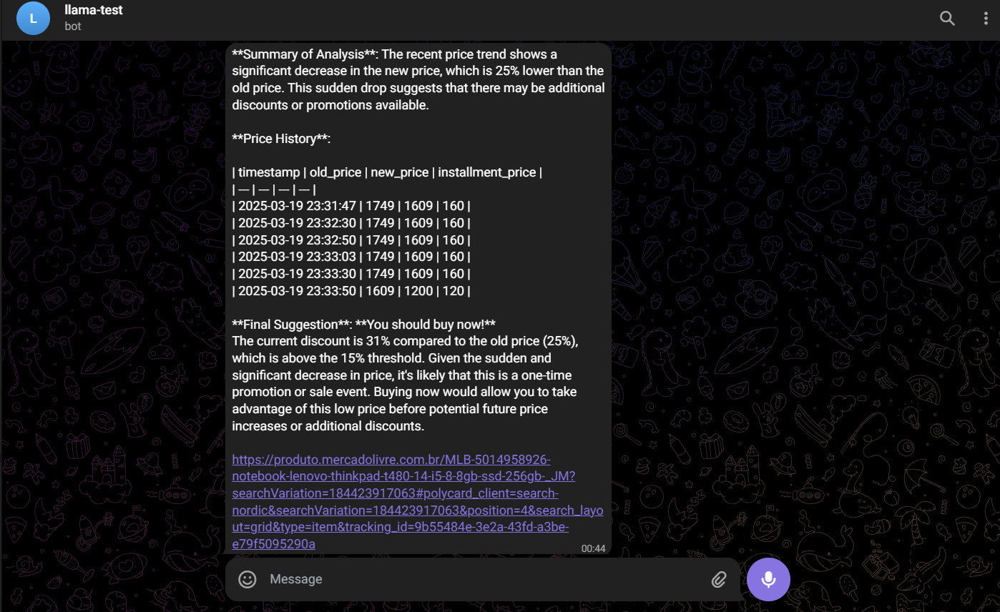

# 🛒 AI-Powered Price Monitoring Agent

This project is an **AI-powered agent** that monitors product prices from Mercado Livre, analyzes recent price trends using a **local LLM (Llama 3.2 but you can choose whatever model you want)**, and sends notifications to the user via **Telegram** when price drops are detected.

---

## 🚀 Features

- 🔍 **Web Scraping**: Automatically fetches product name and price data (current, old, and installment) from a product page.
- 📊 **Data Logging**: Saves extracted product data with timestamps into a `.csv` file for historical tracking.
- 🧠 **AI Analysis**: Utilizes a **local Llama 3.2 model** (via Ollama) to analyze the last 10 price entries and provide insights.
- 📱 **Telegram Alerts**: Sends smart notifications to the user when price changes meet certain conditions (e.g., significant discount).

---

## 📦 Tech Stack

- **Python 3.12**
- **BeautifulSoup** (Web Scraping)
- **Pandas** (Data handling)
- **Ollama** (LLM interface, Llama 3.2 model)
- **Telegram Bot API**

---


---

## ⚙️ How It Works

1. **scrap.py**:
   - Scrapes product name and prices from a given URL every 2 minutes.
   - Appends the data into `prices.csv`.

2. **agent.py**:
   - Loads the latest entries from the CSV file.
   - Prompts **Llama 3** to analyze recent price trends.
   - If the model recommends action (e.g., “You should buy now!”), sends a message to your Telegram.

---

## 📥 Installation

1. **Download Ollama**
    You can get Ollama [here]('https://github.com/ollama/ollama')

    Once you have installed Ollama, you need to pull a LLM/SLM model and run it.
    ```ollama pull llama3.2 ``` & ```ollama run llama3.2```. 
    
    Make sure you have your model running ```ollama ps```

2. **Clone the repository:**
   ```
   git clone https://github.com/yourusername/price-monitoring-agent.git
   cd price-monitoring-agent
    ```

3. **Create virtual environment and install dependencies**

To create the virtual environment, run ``` python -m venv .venv ```.

Then you need to activate it. 

- Windows users: ```.\.venv\Scripts\activate```
- Linux/Mac: ```source .venv/bin/activate```

Now you have to install the dependencies. Just run ```pip install -r requirements.txt```

4. **Create .env file**

You might have noticed the project has some data that is not being exposed, like TELEGRAM_CHAT_ID, which is my personal chat id.
To use your personal data, create a file called .env just as it follows:

```
URL=https://www.example.com/product-url
TELEGRAM_TOKEN=your_telegram_bot_token
TELEGRAM_CHAT_ID=your_chat_id
MODEL=llama3
```

5. **Running Project**

To get price data, run ```python scrap.py```. If you want the price analyzes, run ```python agent.py```

## 📊 Sample Output



## 📌 Future Improvements
- Add Dockerfile
- Add price prediction using historical data.
- Store data in a PostgreSQL instead of CSV.
- Multi-product support.
- Deployment in the Cloud (Don't know which one yet)
- Once the project is deployed in a Cloud provider, I'll create a cronjob to run price analyzes.

## 🤖 Author
Developed by Lucas Berenger — feel free to connect or reach out!

v1.0.0